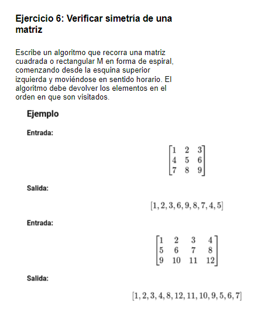

# 1. Formulación del problema

<p align="center">
  
</p>


# 2. Resolución

> I) Entrada del n° de filas y n° de columnas

```bash
    import java.util.Scanner;
```

```bash
    public static void main(String[] args) {
    Scanner sc = new Scanner(System.in);

        System.out.println("Ingresar filas [n]: ");
        int n = sc.nextInt();
        
        if(n <= 0){
           n = sc.nextInt();;
        }  
        System.out.println("Ingresar columnas [m]: ");
        int m = sc.nextInt();
        
        if(m <= 0){
           m = sc.nextInt();;
        }
```
> II) Registro de numeros en la matriz rectangular o cuadratica

```bash
    EspiralCuadrada(m,n);      
```

```bash
    public static void EspiralCuadrada(int d,int e){
    Scanner sc = new Scanner(System.in);    
    int[][] Matriz = new int[d][e];
    int[] Elementos = new int[d*e];
    
    for(int i=0; i < d; i++){
        for(int j=0; j < e;j++){
            System.out.print("["+i+"]"+"[" + j+"]");
            Matriz[i][j] = sc.nextInt();           
        }
    }    
        int arriba = 0;
        int abajo = d - 1;
        int izquierda = 0;
        int derecha = e - 1;
        
        int indexElementos = 0;
        
    for(int i=0; i < d;i++){
        for(int j=0; j < e;j++){
            System.out.print("["+Matriz[i][j]+"]");
        }
        System.out.println("");
    }
```
> III) Reccorido en espiral


```bash
    while (arriba <= abajo && izquierda <= derecha) {
           
            for (int i = izquierda; i <= derecha; i++) {
            Elementos[indexElementos] = Matriz[arriba][i]; 
            indexElementos++;    
            }
            arriba++;

     
            for (int i = arriba; i <= abajo; i++) {
            Elementos[indexElementos] = Matriz[i][derecha];    
            indexElementos++;       
            }
            derecha--; 

 
            if (arriba <= abajo) {
            
            for (int i = derecha; i >= izquierda; i--) {
            Elementos[indexElementos] = Matriz[abajo][i];  
            indexElementos++;      
            }
            abajo--; 
            }

            if (izquierda <= derecha) {
              
            for (int i = abajo; i >= arriba; i--) {
            Elementos[indexElementos] = Matriz[i][izquierda];      
            indexElementos++;      
            }
            izquierda++;   
    }   
    
    }
```

### Codigo completo

```bash
import java.util.Scanner;

public class Main {
    
    public static void EspiralCuadrada(int d,int e){
    Scanner sc = new Scanner(System.in);    
    int[][] Matriz = new int[d][e];
    int[] Elementos = new int[d*e];
    
    for(int i=0; i < d; i++){
        for(int j=0; j < e;j++){
            System.out.print("["+i+"]"+"[" + j+"]");
            Matriz[i][j] = sc.nextInt();           
        }
    }    
        int arriba = 0;
        int abajo = d - 1;
        int izquierda = 0;
        int derecha = e - 1;
        
        int indexElementos = 0;
        
    for(int i=0; i < d;i++){
        for(int j=0; j < e;j++){
            System.out.print("["+Matriz[i][j]+"]");
        }
        System.out.println("");
    }
        
    while (arriba <= abajo && izquierda <= derecha) {
           
            for (int i = izquierda; i <= derecha; i++) {
            Elementos[indexElementos] = Matriz[arriba][i]; 
            indexElementos++;    
            }
            arriba++;

     
            for (int i = arriba; i <= abajo; i++) {
            Elementos[indexElementos] = Matriz[i][derecha];    
            indexElementos++;       
            }
            derecha--; 

 
            if (arriba <= abajo) {
            
            for (int i = derecha; i >= izquierda; i--) {
            Elementos[indexElementos] = Matriz[abajo][i];  
            indexElementos++;      
            }
            abajo--; 
            }

            if (izquierda <= derecha) {
              
            for (int i = abajo; i >= arriba; i--) {
            Elementos[indexElementos] = Matriz[i][izquierda];      
            indexElementos++;      
            }
            izquierda++;   
    }   
    
    }
    for(int i=0; i < Elementos.length;i++){
        System.out.print("["+Elementos[i]+"]");
    }
    }

    public static void main(String[] args) {
    Scanner sc = new Scanner(System.in);

        System.out.println("Ingresar filas [n]: ");
        int n = sc.nextInt();
        
        if(n <= 0){
           n = sc.nextInt();;
        }  
        System.out.println("Ingresar columnas [m]: ");
        int m = sc.nextInt();
        
        if(m <= 0){
           m = sc.nextInt();;
        }
        
        EspiralCuadrada(m,n);      
    }
}
```
# 3. Complejidad

> I) Entrada del n° de filas y n° de columnas

- Complejidad de tiempo: 𝑂(1)
- Complejidad de espacio: 𝑂(1)

> II) Registro de numeros en la matriz rectangular o cuadratica

- Complejidad de tiempo:
  a) Matriz rectangular: 𝑂(d x e)
  b) Matriz cuadratica: 𝑂(d²)
  
- Complejidad de espacio:
  a) Matriz rectangular: 𝑂(d x e)
  b) Matriz cuadratica: 𝑂(d²)   

> III) Reccorido en espiral
- Complejidad de tiempo:
  a) Matriz rectangular: 𝑂(d x e)
  b) Matriz cuadratica: 𝑂(d²)
  
- Complejidad de espacio:
  a) Matriz rectangular: 𝑂(d x e)
  b) Matriz cuadratica: 𝑂(d²)   
